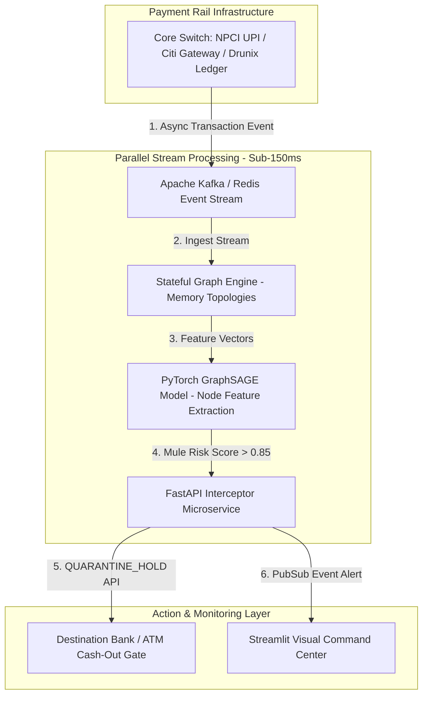

# Sentinel Graph: Real-Time Cross-Rail Mule Interception Engine

> **Drunix Hackathon Submission** | Citi x NPCI  
> **Track:** Fraud Detection  
> **Problem Statement:** Real-Time Payments & Financial Inclusion  

---

## Executive Summary
Sentinel Graph is a parallel stream intelligence engine that intercepts automated money-mule transfers across domestic payment rails (NPCI UPI / Drunix permissioned ledger) and cross-border gateways (Citi) in under 150ms without adding latency to core payment locks.

---

## System Architecture & Drunix Integration

### Core Architecture Components:
1. **Drunix Chaincode Layer (`/drunix_chaincode`):** Go smart contracts deployed on Drunix Lite Peers storing SHA-256 anonymized account reputation states in the SQL ledger.
2. **Stream Interception Microservice (`/backend_service`):** High-throughput FastAPI event listener consuming switch logs asynchronously.
3. **Graph Neural Network (`/ml_engine`):** 2-layer GraphSAGE model evaluating transaction velocity, multi-hop degree ratios, and transient mule structures.

---

## Technology Stack
- **Blockchain / DLT:** Drunix Permissioned Ledger (Hyperledger Fabric architecture), Go Chaincode
- **AI / ML Engine:** PyTorch Geometric (GraphSAGE), NetworkX, Memgraph
- **Stream & API:** Apache Kafka, Redis, FastAPI, Python 3.11
- **Privacy & Security:** 128-bit SHA-256 Hashing, Zero-PII Graph Topologies

---

## 44-Day Implementation Roadmap
- [x] **Phase 1 (Week 1):** Architecture spec, repository initialization, and synthetic AML data generator.
- [ ] **Phase 2 (Weeks 2–3):** Drunix Go chaincode setup & SHA-256 state database mapping.
- [ ] **Phase 3 (Weeks 4–5):** GraphSAGE model training on multi-hop mule transaction graphs.
- [ ] **Phase 4 (Week 6):** FastAPI stream integration & Streamlit real-time visual command center.
